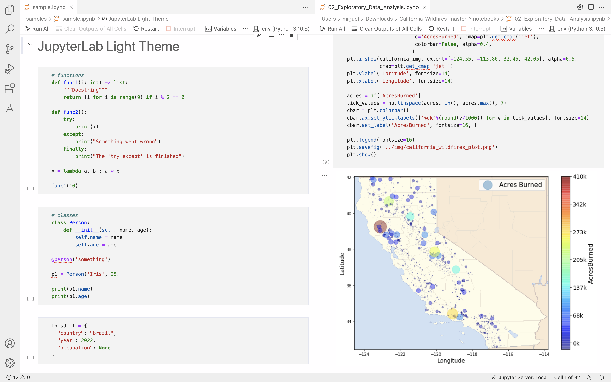

# JupyterLab Light Theme
JupyterLab's light theme for Visual Studio Code!

## Installation
1. In VS Code, go to Extensions.
2. Find "JupyterLab Light Theme" and click Install.
3. Open the Color Theme picker with `⌘K ⌘T` or Preferences > Color Theme.
4. Select the theme **JupyterLab Light Theme**.

## Known Limitations
- This theme only supports **Python** and **Markdown**.
- JupyterLab notebooks are visually more compact than in VS Code.
- Selected cell background remains light gray (same as unselected cells) instead of white.
- Unsupported color differentiation for markdown list levels.
- Markdown code with single backticks doesn't look good in preview (i.e. `code`)

## Credits
This theme is inspired by [Project Jupyter's](https://jupyter.org) JupyterLab. Icon created by [Freepik](https://www.flaticon.com/free-icons/jupiter).

## Author
Author: Miguel Corral Jr.  
GitHub: https://github.com/corralm